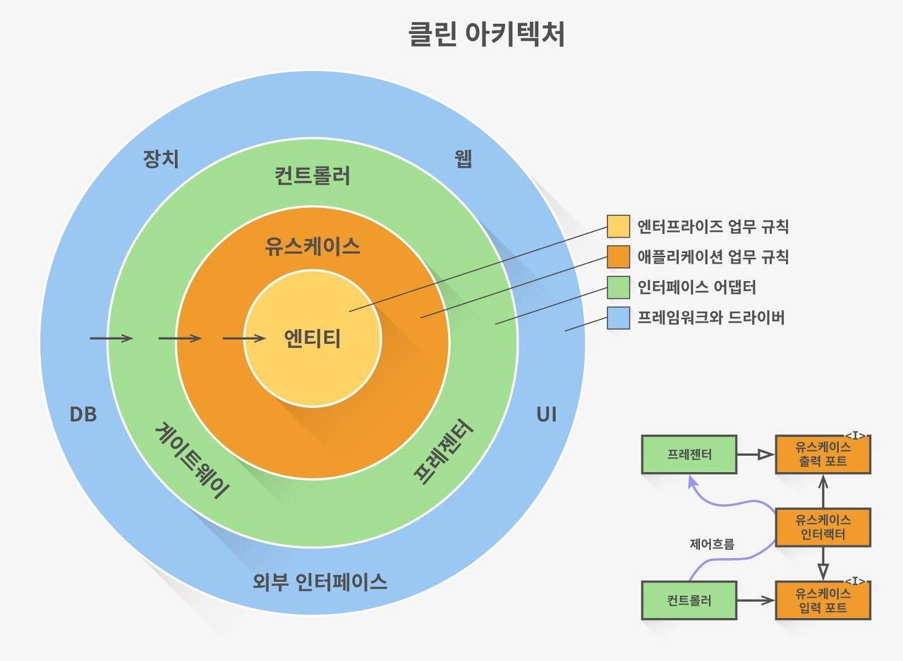

# 22장 클린 아키텍처
- 프레임워크 독립성: 프레임워크을 도구로 사용하며, 프레임워크가 지닌 제약사항으로 시스템을 강제하지 않음
- 테스트 용이성: 업무 규칙은 UI, DB, 웹서버 및 다른 외부 요소 없이도 테스트할 수 있음
- UI 독립성: 시스템의 나머지를 변경하지 않고도 UI를 쉽게 변경할 수 있음
- 데이터베이스 독립성: 오라클이나 MS-SQL 서버 등을 다른 DB로 교체할 수 있고, 업무 규칙은 DB에 결합되지 않음
- 외부 에이전시에 대한 독립성: 실제로 업무 규칙은 외부 세계와의 인터페이스에 대해 전혀 알지 못함

## 의존성 규칙

- 각각의 동심원은 서로 다른 영역이며, 안으로 들어갈수록 고수준의 소프트웨어가 됨

### 엔티티
- 핵심 비즈니스 로직을 캡슐화하며, 외부 변화에도 변경되지 않아야함
- 엔티티는 다양한 애플리케이션에서 재사용이 가능해야 하며, 운영상의 변경이 있어도 엔티티에는 영향 X

### 유스케이스
- 유스케이스는 특정 애플리케이션에 특화된 비즈니스 로직을 다루며, 엔티티와의 데이터 흐름 조정
- 유스케이스 변경이 엔티티에 영향을 주어서는 안 되며, 외부 요소의 변화가 유스케이스에 영향을 미치지 않아야 합니다.

### 인터페이스 어댑터
- 이 계층은 데이터를 외부 시스템에 맞게 변환하며, 특정 기술에 종속된 변환 작업을 수행합니다. 
- 유스케이스가 세부 기술에 의존하지 않도록 어댑터에서 변환을 처리합니다.

### 프레임워크와 드라이버
- 가장 바깥쪽 계층으로, 데이터베이스와 웹 프레임워크 같은 세부 사항들이 위치합니다. 
- 이 계층은 다른 계층과 통신하기 위한 접합 코드를 포함하며, 내부 원에 영향을 주지 않도록 설계됩니다.

### 경계를 횡단하는 데이터는 어떤 모습인가?
- 데이터는 경계를 넘을 때 간단한 데이터 구조를 유지해야 하며, 내부 원에서 사용하기에 편리한 형태여야 합니다.

## 결론
- 소프트웨어를 계층으로 분리하고 의존성 규칙을 준수한다면 본질적으로 테스트하기 쉬운 시스템 만들게 될 것
- DB나 UI 같은 외부 요소가 구식이 되더라도, 이를 교체할 수 있음

# 23장 프레젠터와 험블 객체

## 험블 객체 패턴
- 디자인 패턴으로, 테스트하기 어려운 행위와 쉬운 행위를 단위 테스트 작성자가 쉽게 분리하는 방법
- 행위들을 두 개의 모듈 또는 클래스로 나누는데, 이 중 하나가 험블
    - 기본적인 본질을 남기고, 테스트하기 어려운 행위를 모두 험블 객체로 옮김
    - 나머지 모듈에는 험블 객체에 속하지 않은, 테스트하기 쉬운 행위로 모두 옮김

## 프레젠터와 뷰
- 뷰
    - 험블 객체이며, 테스트하기 어려움
    - 이 객체에 포함된 코드는 가능한 간단하게 유지

- 프레젠터
    - 애플리케이션으로부터 데이터를 받아 화면 표현할 수 있는 포맷으로 만드는 것
    - 이를 통해 뷰는 데이터를 화면으로 전달하는 간단한 일만 처리하도록 만듦

## 테스트와 아키텍처
- 테스트 용이성은 좋은 아키텍처가 지녀야 할 속성으로 오랫동안 알려짐
- 험블 객체 패턴이 좋은 예인데, 테스트하기 쉬운 부분과 어려운 부분으로 분리하면 아키텍처가 정의되기 때문임
- 프레젠터와 뷰는 이러한 경계 중 하나이며, 이 밖에도 수 많은 경계가 존재함

## 결론 
- 경계를 넘나드는 통신은 간단한 데이터 구조를 수반할 때가 많고, 그 경계는 대체로 테스트하기 어려운 무언가와 쉬운 무언가로 분리됨
- 아키텍처 경계에서 험블 객체 패턴을 사용하면, 전체 시스템의 테스트 용이성을 크게 높일 수 있음

# 24장 부분적 경계

## 서론
- 아키텍처 경계: 완벽하게 구현하는 것은 비용이 많이 들고 유지에 큰 노력이 필요함.
- YAGNI 원칙: "You Aren't Going to Need It" 원칙을 위배하는 선행 설계는 탐탁지 않음. 필요할 경우 부분적 경계(partial boundary) 구현 고려.

## 결론
부분적 경계를 구현하는 세 가지 방법

1. 마지막 단계를 건너뛰기: 독립적으로 컴파일 및 배포 가능한 컴포넌트로 만들지 않고 단일 컴포넌트에 모아둠.
2. 일차원 경계: 양방향 Boundary 인터페이스 대신 한방향만 경계를 인터페이스로 격리.
3. 파사드(Facade): 모든 서비스 클래스를 메소드 형태로 정의하고, 호출 시 해당 서비스 클래스로 전달.
4. 각 접근법은 상황에 따라 적절하게 사용될 수 있으며, 완벽한 구현이 아닐 경우 효과가 떨어질 수 있음.
적절한 트레이드오프를 통해 클린 아키텍처를 구현하도록 하자.

# 25장 계층과 경계
## 서론
- 시스템이 UI, 업무 규칙, DB 등 3가지 컴포넌트로 구성된다고 단순화하기 쉬움.
- 대부분의 시스템에서 컴포넌트는 이보다 많음.

## 결론
- 아키텍처 경계는 언제 어디에나 존재할 수 있으며, 필요한 경계를 신중하게 파악해야 함.
- 경계 구현에는 비용이 많이 들고, 경계를 무시하면 나중에 추가하는 비용이 큼.

### YAGNI 원칙
- 추상화가 필요할지를 미리 예측하는 것은 지혜롭지 않음.
- 오버 엔지니어링이 언더 엔지니어링보다 나쁠 수 있으며, 경계를 추가하려면 큰 비용이 들 수 있음.

# 26장 메인 컴포넌트

## 서론
- 모든 시스템에는 최소한 하나의 컴포넌트가 존재하고, 이 컴포넌트가 나머지 컴포넌트를 생성하고 조정하며 관리한다.

## 궁극적인 세부사항

### 역할 및 기능
- 메인 컴포넌트: 시스템의 초기 진입점으로, 가장 낮은 수준의 정책을 다루며, 궁극적인 세부사항을 포함함.
- 의존성 주입: 의존성 주입 프레임워크를 이용하여 의존성을 주입하는 작업이 메인 컴포넌트에서 이루어져야 함.
- 제어권 위임: 메인은 모든 팩토리와 전략, 기반 설비를 생성한 후 제어권을 시스템의 고수준 부분으로 넘김.
- 자율성: 의존성 주입 후, 메인은 프레임워크 없이도 의존성을 분배할 수 있어야 함.

### 메인의 특성
- 지저분한 컴포넌트: 클린 아키텍처에서 가장 바깥의 저수준 모듈로, 상대적으로 지저분한 코드와 설정을 포함.
- 고수준 정책으로 제어권 넘김: 모든 초기 설정을 마친 후, 제어권을 애플리케이션의 고수준 정책으로 넘김.

## 결론
- 플러그인으로서의 메인: 메인은 초기 조건과 설정을 구성하고, 외부 자원을 수집한 후 제어권을 고수준 정책으로 넘기는 플러그인 역할을 함.
- 여러 메인 컴포넌트: 설정 별로 여러 개의 메인 컴포넌트를 두어 플러그인처럼 활용할 수 있음.
- 설정 문제 해결: 메인을 플러그인 컴포넌트로 간주하고 아키텍처 경계 바깥에 위치시키면 설정 관련 문제를 해결하는 데 유리함.

